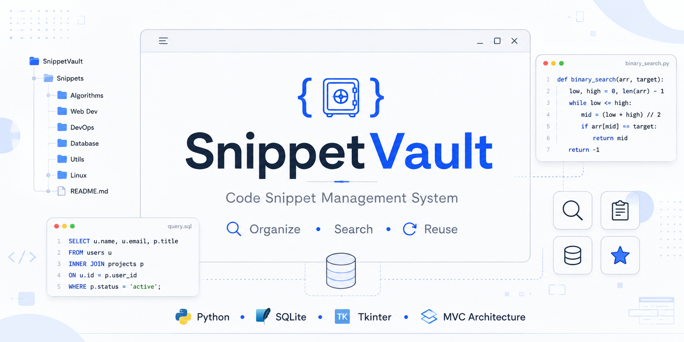
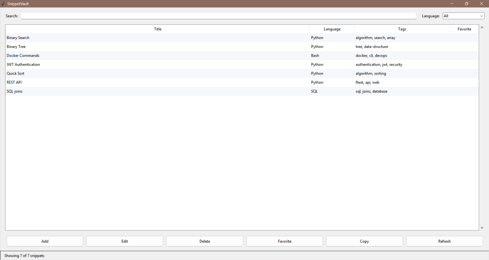
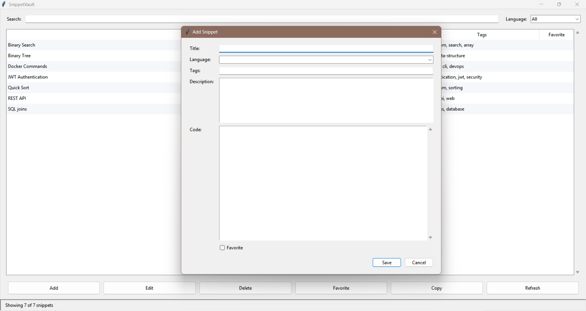
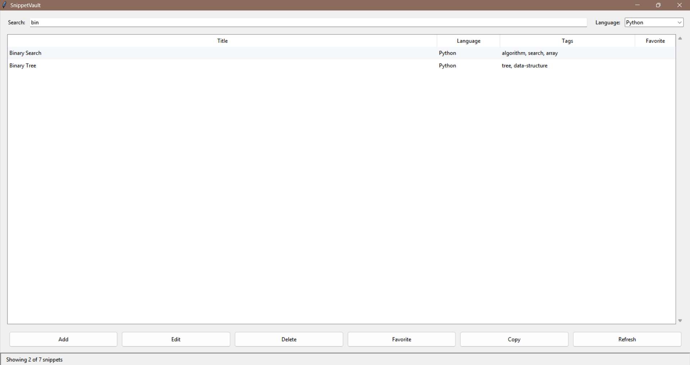
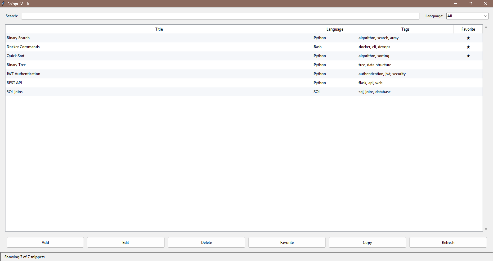
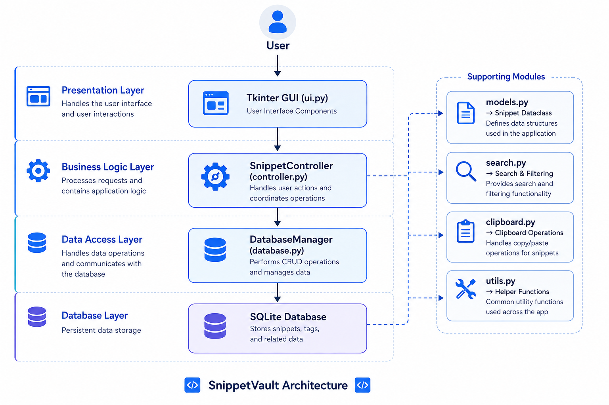

<div align="center">

# SnippetVault

<p align="center">
  
</p>

### A Modern Desktop Application for Managing Reusable Code Snippets

Organize • Search • Reuse


</div>

---

# 📖 Overview

SnippetVault is a desktop application that helps developers organize, search, and manage reusable code snippets in one centralized location.

Instead of storing useful code in scattered folders, text files, or previous projects, SnippetVault provides a structured system for saving, categorizing, searching, and retrieving snippets efficiently.

The application was built as a portfolio project to practice real-world software engineering concepts including object-oriented programming, database integration, modular architecture, CRUD operations, and desktop application development using Python.

---

# ✨ Features

- ➕ Add code snippets
- ✏️ Edit existing snippets
- 🗑 Delete snippets with confirmation
- 👀 View snippet details
- ⭐ Mark snippets as favorites
- 🔍 Search snippets by title
- 🏷 Filter snippets by programming language
- 📋 Copy code directly to clipboard
- 💾 Persistent SQLite database
- ⚡ Keyboard shortcuts
- 🔄 Refresh and automatic table updates
- 📊 Dynamic status bar
- ✅ Input validation and error handling

---

# 📸 Screenshots

## Main Window



---

## Add Snippet



---

## Search & Filter



---

## Favorites



---

# 🏗 Architecture

<p align="center">

</p>

The project follows an MVC-inspired architecture to separate responsibilities and improve maintainability.

```
User
        │
        ▼
Tkinter GUI (ui.py)
        │
        ▼
SnippetController
(controller.py)
        │
        ▼
DatabaseManager
(database.py)
        │
        ▼
SQLite Database
```

---

# 📂 Project Structure

```text
SnippetVault/
│
├── assets/
│   ├── banner.png
│   ├── architecture.png
│   └── screenshots/
│
├── tests/
│
├── clipboard.py
├── controller.py
├── database.py
├── main.py
├── models.py
├── search.py
├── ui.py
├── utils.py
│
├── README.md
├── requirements.txt
├── LICENSE
└── .gitignore
```

---

# 🛠 Technologies Used

| Technology | Purpose |
|------------|---------|
| Python 3.13 | Core programming language |
| Tkinter | Desktop GUI |
| SQLite | Local database |
| sqlite3 | Database access |
| Dataclasses | Data model |
| Git | Version control |
| GitHub | Repository hosting |

---

# 🚀 Installation

## Clone the repository

```bash
git clone https://github.com/YOUR_USERNAME/SnippetVault.git
```

Navigate to the project

```bash
cd SnippetVault
```

(Optional) Create a virtual environment

```bash
python -m venv .venv
```

Activate it

Windows

```bash
.venv\Scripts\activate
```

Install dependencies

```bash
pip install -r requirements.txt
```

Run the application

```bash
python main.py
```

---

# 💻 Usage

1. Launch the application.
2. Add new snippets using the **Add** button.
3. Search snippets by title.
4. Filter by programming language.
5. Mark frequently used snippets as favorites.
6. Edit or delete snippets when needed.
7. Copy code directly to the clipboard for reuse.

---

# 🧪 Testing

The application has been manually tested for:

- CRUD operations
- Search functionality
- Language filtering
- Favorites
- Clipboard operations
- Keyboard shortcuts
- SQLite persistence
- Input validation
- Window resizing
- Startup and restart behavior

---

# 🎯 Software Engineering Concepts Demonstrated

- Object-Oriented Programming
- Modular Design
- MVC-inspired Architecture
- CRUD Operations
- SQLite Database Integration
- Input Validation
- Exception Handling
- Separation of Concerns
- Data Persistence
- Version Control with Git
- Documentation

---

# 🔮 Future Enhancements

- 🌙 Dark mode
- ☁ Cloud synchronization
- 📤 Import / Export snippets
- 🎨 Syntax highlighting
- 🗂 Multiple snippet collections
- 🤖 AI-powered snippet suggestions
- 📝 Markdown preview
- 📑 Rich text descriptions

---

# 👨‍💻 Why I Built This Project

I built SnippetVault to improve my Python skills by developing a complete desktop application rather than following isolated tutorials.

The project helped me gain practical experience with software architecture, database management, GUI development, and clean code organization while creating something useful for developers.

---

# 📄 License

This project is licensed under the MIT License.

---

<div align="center">

### ⭐ If you found this project interesting, consider giving it a star!

</div>